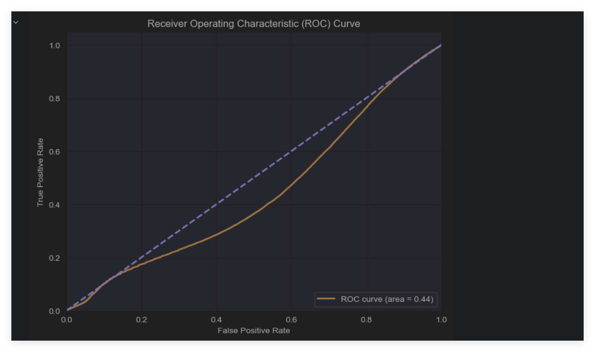
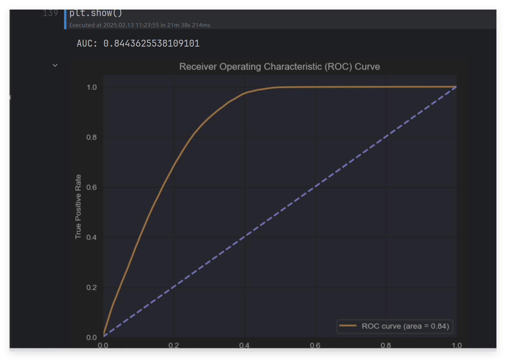

# 第一次 n_estimators 为 200 最好
max_depth 为 20 最好
min_samples_split 为 5 最好
auc 到 0.40

# 第三次调参，根据第二次结果进一步调整参数范围
第二次 n_estimators 为 250 最好
max_depth 为 25 最好
min_samples_split
为 5 最好 -- 到了 0.82
# 第三次 n_estimators 为 250 最好
max_depth 为 28 最好
min_samples_split 为 5 最好
 到了 0.84

